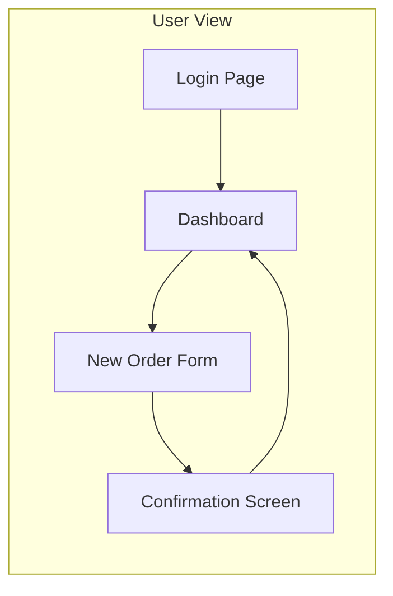
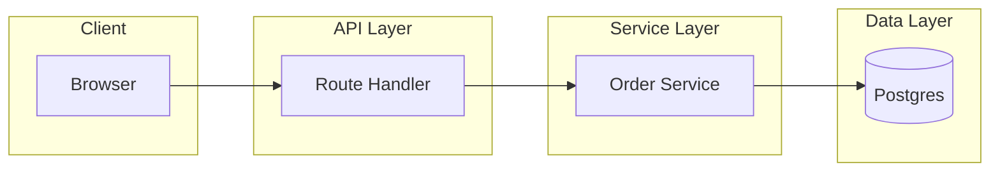
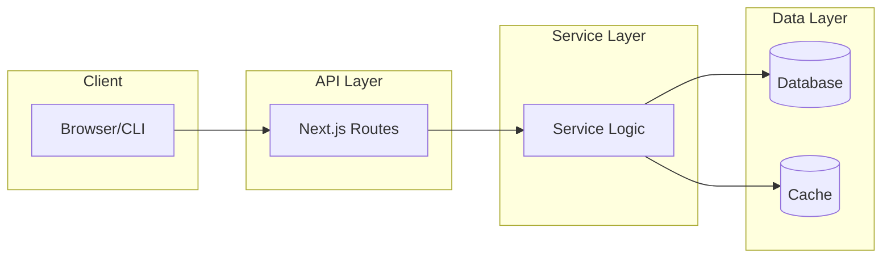

# Plan Server Document Quality Standard

This is the canonical quality standard for every document written to the plan server (`~/Documents/plan-server/projects/**`). Every skill that produces plan server artifacts MUST write documents that satisfy these criteria.

---

## 1. Rendering Capabilities (What the Plan Server Renders)

The plan server renders `.mdx` (plans/designs) and `.md` (handoffs/reports) files. Different parsers handle each — know which one you're writing to.

### 1.1. MDX Documents (plans/, designs/, research/, solutions/, frd/)

These go through the MDX compiler. Full JSX components are available:

**Custom MDX Components:**

| Component | Props | Best Use Case |
|-----------|-------|---------------|
| `<Steps>` | children (paragraphs per step) | Numbered implementation steps, ordered procedures |
| `<Callout type="info|warning|danger|success|neutral">` | type, title, children | Highlighting risks, notes, warnings, important asides |
| `<FileTree>` | children (indented text tree) | Visualizing file/directory structure |
| `<Tag color="#hex">` | color, children | Small inline labels, status indicators |
| `<FileChangeList title="..." items={[{path,lines,summary}]}>` | title, items array | Summarizing file changes in a compact list |
| `<SummaryBlock>` | title, children | Key summary callout box — lead with this |
| `<AssumptionsBlock>` | title, children | Listing assumptions that could break |
| `<NextStepsBlock>` | title, children | Action items, next steps after this doc |
| `<KeyReferences>` | title, children | Important file paths, docs, tickets |
| `<OpenQuestionsBlock>` | title, children | Unresolved questions needing human input |
| `<DecisionBlock>` | title, children | Documenting a key decision and rationale |
| `<RiskBlock>` | title, children | Flagging identified risks |
| `<VerificationBlock>` | title, children | What "done" looks like, how to verify |

**Mermaid Diagrams** — use fenced ```` ```mermaid ```` blocks:
- `flowchart TD` — top-down process flow, decision trees
- `flowchart LR` — left-to-right architecture, data flow between components
- `sequenceDiagram` — request/response flows, API interactions, auth flows
- `stateDiagram-v2` — state machines, lifecycle transitions
- `classDiagram` — data models, entity relationships, type hierarchies
- `gantt` — timeline, phase scheduling, sprint planning
- `pie` — simple proportion/breakdown
- `gitGraph` — branch/merge strategy visualization

**Open Questions Detection:** The plan server's MarkdownRenderer scans for `## Open Questions` sections. Each `- ` bullet under that heading renders as an interactive answer box in the UI. The user can type answers and click "Copy Prompt" to feed back into the agent. **Always use an `## Open Questions` section** when asking the user for input.

### 1.2. Markdown Documents (handoffs/, reviews/, validation/)

These go through the MarkdownRenderer parser (not MDX). Full JSX components are **NOT available** — but the parser provides special callout blocks:

| Syntax Equivalent | Description |
|---|---|
| `> [!summary]` | Summary callout |
| `> [!important]` | Important note |
| `> [!warning]` | Warning callout |
| `> [!danger]` | Danger/error callout |
| `> [!question]` | Open question callout |
| `> [!todo]` | Action items |
| `> [!success]` | Success/verification callout |
| Standard markdown tables | Data comparison, before/after, decision grids |

---

## 2. Universal Frontmatter

Every plan server document MUST start with YAML frontmatter:

```yaml
---
# REQUIRED fields
title: "Descriptive short title"
status: draft | review | approved | in-progress | complete | ready | blocked | awaiting_input
created: 2026-07-04
project: "project-name"
tags: [type, component, context]  # e.g. [plan, auth, backend]
repo: "repo-name"
author: "author-name"
branch: "branch-name-or-no-branch"
commit: "abc1234-or-no-commit"
summary: "One-sentence summary of what this document covers"
last_updated: 2026-07-04
last_updated_by: "author-name"

# OPTIONAL fields (varies by document type)
confidence: high | medium | low    # explore, research
complexity: low | medium | high    # explore
type: handoff | research | design | plan | solutions | frd | review | validation | decision-map
parent: "path/to/parent-doc.md"     # plan references its design; design references its research
phase_count: 5                     # plan, blueprint
unresolved_phase_count: 5          # plan, blueprint
original: "path/to/original.md"    # split-plan
---
```

---

## 3. Filename Convention — Automatic Sorting

Every artifact written to the plan server uses a consistent filename convention that enables automatic chronological sorting. The server sorts alphabetically, so the convention must make alphabetical order = chronological order.

### 3.1. Convention

```
{type}/{YYYY-MM-DD_HH-MM-SS}_{kebab-description}.{ext}
```

| Component | Rule |
|-----------|------|
| `{type}` | `plans/`, `handoffs/`, `research/`, `reviews/`, etc. — flat subdirectory per type, no nesting |
| `YYYY-MM-DD_HH-MM-SS` | ISO-8601 timestamp of when the artifact was created, e.g. `2026-07-04_12-38-06` |
| `{kebab-description}` | Short dash-separated summary of what the artifact covers |
| `{ext}` | `.mdx` for plans, `.md` for everything else |

### 3.2. Examples

| Type | Filename |
|------|----------|
| Plan | `plans/2026-07-04_12-38-06_dashboard-widgets.mdx` |
| Handoff | `handoffs/2026-07-04_12-38-06_plan-five-opencode-operator.md` |
| Research | `research/2026-07-04_12-38-06_auth-bottlenecks.md` |
| Review | `reviews/2026-07-04_12-38-06_pr-142-security.md` |
| Design | `designs/2026-07-04_12-38-06_user-auth-redesign.md` |
| Solutions | `solutions/2026-07-04_12-38-06_event-store-options.md` |

### 3.3. Why This Works

- `2026-07-04_12-38-06` sorts **before** `2026-07-04_12-45-00` alphabetically = chronologically
- `.sort()` = oldest first; `.reverse()` = newest first
- Flat directory per type means no month-nesting to get wrong
- Consistent across all artifact types — the server sorts them all the same way

### 3.4. Migrating Existing Files

Files under legacy month subdirectories (e.g. `handoffs/July/4th_12_38_PM_slug.md`) are read through a backward-compatibility fallback in the server. New files follow the flat ISO convention automatically. Existing files can be batch-renamed to the new convention, but they will still appear in the UI via the fallback.

### 3.5. Creating Artifacts

- **Plans** → use the `plan-server` skill script (`plan-server.mjs`), which generates ISO-prefixed `.mdx` filenames
- **Handoffs, research, reviews, etc.** → use `new-artifact.py --type {type} --dest ~/Documents/plan-server --project {name}`, which now generates ISO-prefixed filenames
- **Design, discover, explore, blueprint skills** → construct filenames from `now.mjs` `<slug>` (which is the ISO timestamp) + brief kebab description

---

## 4. The Human-in-the-Loop Checklist

Every plan server document MUST satisfy ALL of the following criteria before being written. This is not aspirational — this is the standard.

### 4.1. TRADE-OFFS

Every significant decision MUST state what was gained AND what was sacrificed.

**Bad:** "We chose Postgres for the event store."  
**Good:** "We chose Postgres for the event store. This gives us ACID guarantees and avoids a new infrastructure dependency, at the cost of lower write throughput compared to a purpose-built event store like EventStoreDB. We accept this because our event volume is under 100 writes/sec."

Use a table when comparing multiple trade-offs side by side:

| Decision | Gain | Cost | Accepted Why |
|----------|------|------|-------------|
| Postgres event store | ACID, no new infra | Lower write throughput | Volume <100 writes/s |
| Manual mapping | No build step, explicit | More boilerplate | 8 types only |

### 4.2. ALTERNATIVES CONSIDERED

Every document that recommends an approach MUST include an alternatives section. For each alternative:

| Alternative | Why Considered | Why Not Chosen | Tradeoff Accepted |
|---|---|---|---|
| {Approach B} | {what it offered} | {specific reason} | {what giving up B means} |
| {Approach C} | {what it offered} | {specific reason} | {what giving up C means} |

If no alternatives were explicitly considered, note this as a risk: **"No record of alternatives being evaluated — this is a risk."**

### 4.3. SECURITY IMPLICATIONS

Every document MUST consider and document security implications from the OWASP Top 10 that apply to the scope. For each relevant item, state the implication and mitigation:

- **Broken Access Control**: {who can access what — e.g., "Only workspace admins can approve plans"}
- **Cryptographic Failures**: {data at rest / in transit — e.g., "Tokens stored in DB, not encrypted at rest"}
- **Injection**: {e.g., "User-provided names are rendered via MDX — must sanitize `<` and `{`"}
- **Security Misconfiguration**: {e.g., "New API endpoint has no rate limiting — defer to Phase 3"}
- **Vulnerable Components**: {e.g., "Introduces `mermaid` v11 — check for known CVEs"}
- **Data Handling**: {what data is stored, transmitted, exposed to whom}

Skip irrelevant items with a note: "N/A — no network boundary crossed" or "N/A — no user input involved."

### 4.4. ARCHITECTURE FIT — Two-View Mermaid Diagrams

Every document MUST include at least TWO Mermaid diagrams showing how the proposed work fits into the system. One without the other is incomplete:

#### Diagram 1: User View — What the User Actually Sees

Show the system from the **user's perspective**: screens, buttons, flows they click through, states they observe. This is the external-facing view — no internal plumbing, no DB queries, no service layers. Use it to trace through a complete user journey end-to-end. Every arrow must trace a concrete user action.



**What this communicates**: "If I'm the user, what do I experience? What screens change? What do I click next?" This grounds the reviewer in the feature's UX reality before they dive into implementation.

**Best diagram types**: `flowchart LR` (screen flow), `sequenceDiagram` (user → UI interactions), `stateDiagram-v2` (UI states like loading/empty/error).

#### Diagram 2: Developer View — How It Works Under the Hood

Show the system from the **developer's perspective**: components, modules, data flow, service boundaries, integration points, request/response chains. This is the internal-facing view — what code touches what. Every arrow must trace a concrete data or control path through the codebase.



**What this communicates**: "How does data flow? What component depends on what? Where does new code slot in?" This gives the reviewer the architectural trace they need to assess coupling, risk, and maintainability.

**Best diagram types**: `flowchart LR` (component architecture), `sequenceDiagram` (request/response lifecycle), `classDiagram` (data model), `stateDiagram-v2` (entity lifecycle).

#### Both Diagrams Required — Traceable by Design

The User View proves the feature makes sense from the outside. The Developer View proves the implementation is sound from the inside. **Always present User View first, then Developer View** — establish what the user experiences before showing how it works.

Every node and arrow must be traceable. The reviewer should be able to follow each path end-to-end: from a user action in the User View to the corresponding code path in the Developer View. If a User View arrow has no corresponding Developer View arrow, the implementation has a gap. If a Developer View arrow has no corresponding User View arrow, there's dead code or an untested path.

#### Choosing the Right Diagram Type Per View

| Purpose | Diagram Type | View |
|---------|-------------|------|
| Screen flow & navigation | `flowchart LR` or `flowchart TD` | User |
| UI states (loading/empty/error) | `stateDiagram-v2` | User |
| User → system interaction cycle | `sequenceDiagram` | User → Dev bridge |
| Component architecture & dependencies | `flowchart LR` with subgraphs | Developer |
| Request/response lifecycle | `sequenceDiagram` | Developer |
| Data model / entity relationships | `classDiagram` | Developer |
| State machine / entity lifecycle | `stateDiagram-v2` | Developer |
| Processing pipeline | `flowchart LR` with subgraphs | Developer |
| Decision flow / branching logic | `flowchart TD` | Developer |

### 4.5. NECESSITY — "Can We Do Without This?"

Every document MUST include a necessity assessment:

```
## Necessity

**Q: Could we achieve the goal without this change?**

{Yes | No | Partially} — {1-2 sentence justification}

**Q: What alternatives exist that don't require this specific change?**

{Alternative approaches that avoid this work entirely}

**Q: What happens if we defer this?**

{Impact of not doing it / deferring to later}
```

This prevents scope creep by forcing explicit justification.

### 4.6. SIMPLICITY vs FLEXIBILITY

Explicitly call out where the design optimized for simplicity (premature optimization avoided) vs where it opted for flexibility (future-proofing). Be honest:

```
## Simplicity vs Flexibility

- {Decision}: optimized for simplicity — {why flexible option was rejected}
- {Decision}: opted for flexibility — {why the simple path isn't enough}
- {Decision}: kept configurable — {the knob exposed and why}
- {Decision}: deliberately NOT configurable — {the parameter hard-coded and why}
```

### 4.7. LOW COUPLING, HIGH COHESION

Check and document the coupling profile:

```
## Coupling Analysis

**File/Module**: {name}
- Inbound deps: {N} consumers — {list major consumers or "internal only"}
- Outbound deps: {N} dependencies — {list external packages or "stdlib only"}
- Cohesion: {High | Medium | Low} — {the module serves {N} distinct concerns}
- Coupling concern flagged: {description if any, or "none — clean module boundary"}
```

Flag any module that serves 3+ unrelated concerns (needs splitting) or has >10 inbound or outbound deps from disparate areas of the codebase.

### 4.8. READABLE CODE

Every document that contains code samples MUST audit readability:

```
## Readability Audit

- Variable/function names describe intent at a glance: {Yes | Mostly | No — flag names}
- No excessive abbreviations: {status | concerns}
- Single responsibility per function: {status | concerns}
- Function lengths appropriate (<40 lines typical): {status | concerns}
- File structure follows project conventions: {status | concerns}
- No commented-out code: {verified}
```

Flag specific names that don't pass the "describe what it does in 2 words" test. Propose renames inline.

### 4.9. COMMENTS

```
## Comments Quality

- API/public exports have doc comments: {Yes | Partial | No}
- Complex logic has "why not what" comments: {Yes | Missing at {file:line}}
- No commented-out code: {verified}
- No obvious/tautological comments: {verified}
```

### 4.10. TESTING & TDD

```
## Testing Approach

- {N} new test files created
- {N} existing test files modified
- Testing API available for frequently-called functions: {Yes | Needed — extract helpers}
- TDD skill invoked: {Yes — written test-first | No — reason}
- Edge cases covered: {list}
```

If frequently-called functions lack a testing API (helper factory, test fixture, mock builder), extract one and document it.

---

## 5. Document-Type-Specific Guidance

Each document type has specific required sections beyond the universal checklist:

### 5.1. Plan Documents

Used by: to-plan skill, blueprint skill, split-plan skill

**Structure:**
- Overview (what and why)
- Desired End State
- What We're NOT Doing
- Per Phase: Overview → Changes Required (with file paths) → Success Criteria (Automated + Manual)
- Testing Strategy
- Performance Considerations
- Migration Notes
- References

**Key Principle:** One phase = one vertical slice. Each phase is self-contained, sequential, and has clear success criteria.

**Mermaid Usage:** Include a high-level `flowchart LR` showing phase dependencies and inter-phase data flow.

### 5.2. Handoff Documents

Used by: handoff skill

**Purpose:** Transfer clean, verified, implementation-relevant context into a new agent session. Not a human-facing summary.

**Structure:**
- Active Goal (user's latest confirmed objective, linked plans/artifacts)
- Current State (verified facts vs assumptions)
- Latest User Intent (resolved requirements, with corrections noted)
- Locked Decisions (decision + reason + constraint)
- Do Not Repeat (rejected approaches that would waste time)
- Work Completed (change + why + files + verification)
- Relevant Files (path + status + role + changes + next use)
- Remaining Work (ordered tasks with dependency, verification, done-when)
- Resume Here (exact next action)
- Open Questions or Blockers
- Verification Status (tests passed/failed/unverified)
- Success Criteria (binary completion checklist)

**Key Principle:** Optimize for a coding agent who must continue without the original conversation. Compact but complete. verified facts separated from assumptions. Rejected approaches explicitly flagged. Next action explicit.

**Mermaid Usage:** Only if essential for complex multi-component data flow. Do not add Mermaid by default.

### 5.3. Research Documents

Used by: research skill

**Structure:**
- Summary (high-level findings)
- Detailed Findings (per area with file:line)
- Code References (as jump-table, not narrative)
- Integration Points (inbound refs, outbound deps, wiring)
- Architecture Insights
- Precedents & Lessons (with commit hashes)
- Historical Context (links to existing docs)
- Developer Context (Q&A from checkpoint)
- Open Questions

**Key Principle:** Facts only, no implementation recipes. File:line references throughout. Compressed context for the next session.

**Mermaid Usage:** Use `flowchart LR` to document discovered architecture, `classDiagram` for data relationships.

### 5.4. Design Documents

Used by: design skill

**Structure:**
- Summary
- Requirements
- Current State Analysis
- Scope (Building / Not Building)
- Decisions (with alternatives and trade-offs)
- Architecture (per file with code)
- Slices (decomposition — each with Success Criteria)
- Desired End State
- File Map
- Ordering Constraints
- Verification Notes
- Performance Considerations
- Pattern References
- Developer Context

**Key Principle:** Settled decisions, not discussion. Architecture code and slice decomposition are the core deliverables.

**Mermaid Usage:** Required. Show the high-level architecture (`flowchart LR`), data flow (`sequenceDiagram`), and state machines (`stateDiagram-v2`) where relevant.

### 5.5. Solutions Documents

Used by: explore skill

**Structure:**
- Summary (problem, recommended option, effort, confidence)
- Problem Statement (requirements, constraints, success criteria)
- Current State (existing implementation, patterns, integration points)
- Solution Options (2-4 candidates with pros/cons per option)
- Comparison Table (criteria × options)
- Recommendation (selected option, rationale, trade-offs)
- Implementation Approach (phases)
- Risks & Mitigations
- Scope Boundaries

**Key Principle:** Options are what this document sells. Each must have evidence (file:line for codebase, links for external). The comparison table is the centerpiece.

**Mermaid Usage:** Per-option architecture diagram showing how each approach would integrate.

### 5.6. FRD Documents

Used by: discover skill

**Structure:**
- Summary
- Problem & Intent (developer's words, verbatim)
- Goals / Non-Goals
- Functional Requirements (numbered, independently testable)
- Non-Functional Requirements (perf, security, UX, reliability)
- Constraints & Assumptions
- Acceptance Criteria (observable pass conditions)
- Recommended Approach (1-2 sentences)
- Decisions (full Q&A log)
- Open Questions
- Suggested Follow-ups
- References

**Key Principle:** The developer's intent drives every decision. Verbatim capture of their framing.

### 5.7. Review Documents

Used by: review skill, code-review skill, persona-critique skill

**Structure:**
- Summary (what was reviewed, fixed point, scope)
- Standards Review (per-file findings with severity)
- Spec Review (requirements vs implementation)
- Findings Table (severity × file × finding × recommendation)
- Recommendations
- Validation report: phased status, automated results, deviations

**Mermaid Usage:** Only for complex multi-component reviews showing dependency chains.

### 5.8. Decision Map Documents

Used by: decision-mapping skill

**Structure:**
- Per ticket: slug, blocked-by, status, type, question, answer
- Compact — the whole map is context for every session
- Ticket types: Research, Prototype, Grilling
- Fog-of-war pushback — investigate the frontier, resolve tickets in order

---

## 6. Mermaid Diagram Best Practices

### 6.1. When to Use Each Diagram Type

| Diagram Type | When to Use |
|---|---|
| `flowchart LR` | System architecture, component relationships, data pipelines. **Most common.** |
| `flowchart TD` | Decision trees, process flows, top-down procedure. Use when reading order is top-to-bottom. |
| `sequenceDiagram` | Request/response flows, API interactions, auth handshakes, actor-boundary interactions. |
| `stateDiagram-v2` | Entities with lifecycle states, workflow stages, connection state machines. |
| `classDiagram` | Data models, entity relationships, type hierarchies. Use for schema design docs. |
| `gantt` | Phase scheduling, sprint timelines. Only in plans with clear phase durations. |
| `pie` | Simple proportional breakdowns (e.g., "time spent by layer"). Rare. |

### 6.2. Two-View Diagram Requirement

Every document MUST have at least two diagrams — see **4.4 ARCHITECTURE FIT** for the full requirement.

**User View first** — screens, flows, states from the outside. Then **Developer View** — components, data flow, service boundaries from the inside.

The two views must be **traceable**: every path in the User View should have a corresponding code path in the Developer View. If the User View shows a user clicking "Submit Order", the Developer View must show where that request goes and what processes it.

### 6.3. Diagram Quality Rules

1. **Every arrow must have a label.** `A --> B` with no label is a missed communication opportunity.
2. **Nodes must have display labels** (`A[Descriptive Label]`), not bare IDs (`A`).
3. **Use subgraphs** for bounded contexts or system boundaries: `subgraph Frontend`.
4. **Color-code by layer or concern** using `:::class` syntax — but only when it adds signal (don't over-style).
5. **Keep diagrams focused.** One diagram = one concept. A 40-node monster should be 3 smaller diagrams.
6. **Put the system-context diagram first** in every document, then detailed diagrams for specific flows.

### 6.4. Standard Architecture Diagram Template



---

## 7. Document Flow — Which Document Precedes Which

```
discover (FRD)
    ↓
research (Research Document)
    ↓
explore (Solutions Document) ─┐
    ├──→ design (Design Document)
blueprint ────────────────────┤
    │                         ↓
    └──→ plan (Plan Document)
                ↓
            implement
                ↓
            validate (Validation Report)
                ↓
            review (Review Document)

handoff ────────────────────→ (any point — session boundary)
split-plan ──────────────────→ (post-plan, when plan is too large)
decision-mapping ────────────→ (pre-discover, when idea is too vague)
```

---

## 8. Frontmatter Status Lifecycle

```
discover FRD:               draft → complete
research:                   draft → complete
explore:                    draft → ready | blocked | awaiting_input
design:                     draft → review → approved | complete
plan:                       draft → review → ready
blueprint:                  draft → in-progress → ready
handoff:                    draft → complete
review / code-review:       draft → complete
validate:                   draft → complete
```

---

## 9. Writing Style Rules

1. **Lead with the conclusion.** Every section starts with the answer, then the evidence.
2. **Be specific, not generic.** "The `POST /api/orders` endpoint validates `userId` against the session token" not "Security is handled properly."
3. **file:line references everywhere.** Every claim about the codebase cites its source. Format: `path/to/file.ext:line` or `path/to/file.ext:start-end`.
4. **Tables over prose for comparisons.** Alternatives, trade-offs, findings-by-file — use tables.
5. **Mermaid over narrative for flows.** If you're describing a multi-step process, draw it.
6. **Callouts for attention.** Use `<Callout type="warning">` or `> [!warning]` for risks, not burying them in a paragraph.
7. **Open Questions are interactive.** Always format as `- ` bullet items under `## Open Questions`. The UI renders answer boxes.
8. **No filler.** Every paragraph carries signal. No "As previously mentioned," "It is worth noting that," or "In conclusion."
9. **One document type per file.** Don't mix handoff content into a research doc.
10. **Compress, don't truncate.** A 300-line document that covers every aspect is better than a 50-line summary that omits details. Use file:line references to compress but not truncate.
