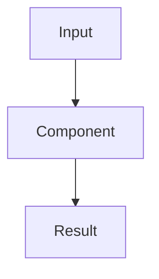

# Explain

Take a plan, spec, PRD, diff, or change and produce a focused explanation. Not a summary — a reasoned breakdown of why this path was chosen, what was traded off, and how it fits. Documents trade-offs, alternatives, security implications, and architecture fit with Mermaid diagrams, keeping the human in the loop.

## Output

Write to the plan server under the current project:

```bash
python3 ~/.agents/scripts/new-artifact.py --dest ~/Documents/plan-server --project <project> --type research --topic "<topic> explain"
```

Fill the generated file with the explanation.

## Quality Standard

Before writing, read the **Plan Server Document Quality Standard** for the Human-in-the-Loop Checklist (trade-offs, security, architecture diagrams, alternatives, necessity, coupling, etc.):

```bash
cat "${SKILL_DIR}/../_shared/plan-server-doc-quality.md"
```

Apply the checklist before declaring the explanation complete.

## Structure

### Why This Exists

What problem does this plan solve? Why now? What happens if we don't do it? Ground this in real context — not generic statements.

### The Approach

What are we actually building or changing? 2-4 sentences. Use a Mermaid diagram if there's a flow, architecture, or state machine worth showing:



Keep this visual and concrete. Prefer a diagram over prose when the relationship is structural.

### Alternatives Considered

This is the highest-value section. For each alternative the team could have taken:

| Alternative | Why considered | Why not chosen | Tradeoff accepted |
|---|---|---|---|
| {approach B} | {what it offered} | {specific reason} | {what giving up B means} |
| {approach C} | {what it offered} | {specific reason} | {what giving up C means} |

If no alternatives were explicitly considered, note that as a risk: "No record of alternatives being evaluated."

### Tradeoffs

What did we give up to get this? Be honest:

- **Speed vs flexibility**: {what was prioritized}
- **Scope**: {what was explicitly deferred}
- **Complexity**: {what got simpler, what got harder}
- **Dependencies**: {what we now rely on}

### How It Connects

How does this step move the project toward its goal? Not in generic terms — be specific about the milestone or capability this unlocks. If this is one slice of a larger plan, show where it fits.

### Open Questions

Anything unresolved that would change the approach if answered differently.
