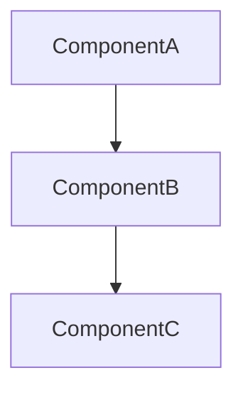

# Create Handoff

You are tasked with writing a handoff document to hand off your work to another agent in a new session. You will create a handoff document that is thorough, but also **concise**. The goal is to compact and summarize your context without losing any of the key details of what you're working on.

## Input

`$ARGUMENTS` — optional description (used in the handoff filename slug).

## Metadata

```!
node "${SKILL_DIR}/../_shared/now.mjs"
echo
node "${SKILL_DIR}/../_shared/git-context.mjs"
```

- `now.mjs` (line 1) — `<iso>\t<slug>` tab-separated. Use `<iso>` for any `date:` frontmatter field.
- `git-context.mjs` — provides `repo:`, `branch:`, `commit:`, `author:` labels. Use `author:` for frontmatter `author:` and `last_updated_by:`.

Copy values verbatim — do not reformat the timezone offset.

## Process

### 1. Create the file

Run this to create the handoff file under the plan server project structure:

```bash
PLAN_SERVER="$HOME/Documents/plan-server"
python3 ~/.agents/scripts/new-artifact.py \
  --dest "$PLAN_SERVER" \
  --project "$(basename $(git rev-parse --show-toplevel 2>/dev/null || echo 'general'))" \
  --type handoffs \
  "<description>"
```

Where `<description>` is a short slug of what you were working on (from `$ARGUMENTS`, or auto-generated from context). If `$ARGUMENTS` is empty, use a brief topic summary. The project name is inferred from the git repo name; override with `--project <name>` if needed.

The script creates the file and prints its path. **Do not construct the path yourself** — use the path the script returns.

The handoff will be viewable in the plan server at:
`http://localhost:3456/project/{project}/handoffs`

### 2. Write content

Open the generated file and replace the template content with the full handoff.

The handoff must be **Obsidian-friendly** — easy for a human to open in Obsidian, scan quickly, and stay in the loop. Use headings, callouts, diagrams, checklists, and Obsidian links.

Use this structure:

```markdown
---
date: {ISO timestamp from now.mjs}
author: {Author name from git-context.mjs}
commit: {Current commit hash}
branch: {Current branch name}
repository: {Repository name}
topic: "{Feature/Task Name} - Handoff"
tags: [handoff, {relevant-tags}]
status: complete
last_updated: {Same ISO timestamp}
last_updated_by: {Author name}
type: handoff
---

# Handoff: {concise description}

> [!summary]
> Short 2-3 sentence summary of what was being worked on, what state it's in, and what the next agent needs to know to pick up immediately.

## What Was Being Built

Explain the task or problem in plain terms. What was the goal? What approach was taken?

## Architecture / Flow

If the work involves a system, data flow, agent flow, or multiple components, include a Mermaid diagram:



> [!important]
> **Critical References:** {list 2-3 key file paths or documents the next agent MUST read first}

## Current State

Describe the current state of the work:
- What's completed
- What's in progress
- What hasn't been started yet

### Key Changes Made

{describe recent changes using `path/to/file.ext:line` references}

```
- `src/feature/api.ts:12-24` — added endpoint handler
- `src/feature/model.ts:45` — fixed edge case with empty input
```

## Decisions Made

Use this format for important decisions:

### Decision: {title}
**Why:** {reason}
**Tradeoff:** {what was given up}
**Status:** Approved / Pending

> [!question]
> **Open Questions:** {anything still unclear or needing human input}

## Learnings

{important patterns, root causes, or insights discovered. Use `path/to/file.ext:line` references.}

> [!todo]
> **Action Items & Next Steps**
> - [ ] {concrete next step for the next agent}
> - [ ] {another step}
> - [ ] {yet another step}

## Related Notes

{Obsidian links to related documents — use `[[note-name]]` even if the file doesn't exist yet}

- [[architecture-overview]]
- [[plan-{feature-name}]]
- [[decision-{topic}]]

> [!warning]
> **Assumptions:** {any assumptions the work was based on that might not hold}
```

### 3. Approve

Save the document.

Once this is completed, you should respond to the user with the template between `<template_response></template_response>` XML tags. Do NOT include the tags in your response.

<template_response>
Handoff written to:
`{path-from-script}`

---

💬 Follow-up: describe extra context in chat to append to this handoff before chaining; re-run `/skill:handoff` for a fresh handoff document.

**Next step:** `/skill:recall {path-from-script}` — pick up where this session left off in a fresh context.

> 🆕 Tip: start a fresh session with `/new` first — chained skills work best with a clean context window.
</template_response>

---
## Additional Notes & Instructions
- **more information, not less**. This is a guideline that defines the minimum of what a handoff should be. Always feel free to include more information if necessary.
- **be thorough and precise**. include both top-level objectives, and lower-level details as necessary.
- **avoid excessive code snippets**. While a brief snippet to describe some key change is important, avoid large code blocks or diffs; do not include one unless it's necessary (e.g. pertains to an error you're debugging). Prefer using `/path/to/file.ext:line` references that an agent can follow later when it's ready, e.g. `packages/dashboard/src/app/dashboard/page.tsx:12-24`
- The `new-artifact.py` script handles path construction, date math, and month-local week numbering. Do not construct paths yourself.

## Clipboard

After writing the handoff file, immediately run `bash` with `pbcopy <absolute-path>` (using the path from the script output) so the user's clipboard has the file path.
