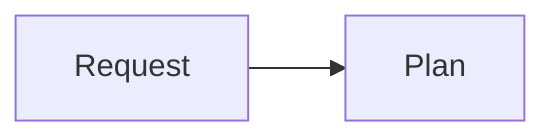

# Quality Standard

Every plan server document MUST also satisfy the **Plan Server Document Quality Standard**:

```bash
cat "${SKILL_DIR}/../_shared/plan-server-doc-quality.md"
```

Reference this before writing any plan server document. The quality standard defines:
- Available MDX components and when to use each
- The Human-in-the-Loop Checklist (trade-offs, security, architecture diagrams, etc.)
- Document-type-specific required sections for plans, handoffs, research, design, explore, discover, reviews
- Mermaid diagram best practices for every diagram type
- Frontmatter format and status lifecycle
- Writing style rules (lead with conclusion, file:line everywhere, tables over prose)

Always reference the quality standard checklist before declaring a document complete.
# Plan Server (publisher utility)

This skill is an explicit **publisher/server utility**: it takes an existing plan and publishes it to the local MDX plan server, returning the URL. It does not plan, decompose, or refine work — `/plan` owns planning. Use this only when you already have a plan document to publish.

```bash
node "${SKILL_DIR}/scripts/plan-server.mjs" "$ARGUMENTS"
```


The canonical `/plan` produces local structured plans (under `.omo/plans/<slug>/`). `/plan-server` publishes the completed plan through the existing script, which wraps its contents in the plan-server MDX envelope and writes it to the detected project location. It does not perform planning or refinement. To publish an existing plan file, pass its path with `--input-file`:

```bash
node "${SKILL_DIR}/scripts/plan-server.mjs" --input-file "$ARGUMENTS"
```

The project is auto-detected from git/cwd. Override with `--project <name>`.

To open the published plan in the browser automatically:

```bash
node "${SKILL_DIR}/scripts/plan-server.mjs" --open "$ARGUMENTS"
```

The script can also publish plan content passed via stdin:

```bash
cat /path/to/plan.md | node "${SKILL_DIR}/scripts/plan-server.mjs" --title "Existing Plan Title"
```


## Script Output

The script prints JSON:

```json
{
  "file": "/Users/isaiahrivera/Documents/Github/plan-server/projects/general/plans/2026-06-19_19-50-01_feature.mdx",
  "id": "2026-06-19_19-50-01_feature",
  "project": "general",
  "url": "http://localhost:3456/project/general/plan/2026-06-19_19-50-01_feature",
  "allPlans": "http://localhost:3456/",
  "server": "already-running",
  "opened": false
}
```

Return the `url` and `file` to the user.

## Before Publishing

The plan to publish must already exist and be complete. Verify before running the script:

- Confirm the plan file exists and is fully written (from `/plan` or an existing plan document).
- Do not invent file paths, statuses, dependencies, or verification commands.
- Do not synthesize a new plan brief — `/plan` produces the plan; this skill only publishes its completed contents.

## MDX Format

The server reads `.mdx` files from project directories:

```text
"$("$HOME/.agents/scripts/plan-server-path")"/projects/{project}/plans/
```

Frontmatter is required. `project` field is optional but encouraged:


```yaml
---
title: "Descriptive plan title"
status: draft
project: "project-name"
tags: [frontend, dashboard]
repo: "repo-name"
author: "author"
branch: "branch-name"
commit: "abc1234"
summary: "One-line summary"
---
```

Supported statuses:

```text
draft, review, approved, in-progress, complete
```

Supported custom components (Note: `<FileTree>` is now natively parsed in both `.md` handoffs and `.mdx` plans):

```mdx
<Steps>
Investigate the current flow.

Implement the change.

Verify the behavior.
</Steps>

<Callout type="warning">
  Risk or blocker text.
</Callout>

<FileTree>
src/
  components/
    Example.tsx
</FileTree>
```

Mermaid diagrams are supported:

````mdx

````

## Open Questions

Use this exact section when the agent needs user input:

```mdx
## Open Questions

- Should the layout be persisted in localStorage or the backend?
- What fallback is required for browsers without CSS subgrid?
- What verification proves this is complete?
```

The website detects bullet items under `## Open Questions` and renders answer boxes. The user can fill them in and click `Copy Prompt`; the copied prompt includes the plan title, each question, and each answer.

## MDX Safety Rules

- Do not write raw `<--` inside MDX. Use `-` or wrap text in a fenced code block.
- Avoid raw `<` unless it starts a real JSX component or is inside a fenced code block.
- Keep file-tree annotations plain, for example `style.css - design system core`.
- If manually writing a plan, run `npm run build` in the plan server root (`"$("$HOME/.agents/scripts/plan-server-path")"`) before claiming it works.

## Manual Fallback

Only use this when the script is unavailable.

1. Determine the project name (default: `general`).
2. Build an id: `<timestamp>_<short-kebab-title>`.
3. Write `"$("$HOME/.agents/scripts/plan-server-path")"/projects/{project}/plans/<id>.mdx`.
4. Verify:

```bash
cd "$("$HOME/.agents/scripts/plan-server-path")"
npm run build
curl -sf http://localhost:3456/api/plans >/dev/null || PORT=3456 node server.js
```

5. Return:

```text
Plan created: "$("$HOME/.agents/scripts/plan-server-path")"/projects/{project}/plans/<id>.mdx
View it: http://localhost:3456/project/{project}/plan/<id>
All plans: http://localhost:3456/
```

## Clipboard

After the script publishes the plan file, immediately run `bash` with `pbcopy <absolute-path>` (using the `file` value from JSON output, or the path from Step 5) so the user's clipboard has the file path.


## Rich Document Guide

### When to Use Each MDX Component

Every component registered in the plan server frontend (see `src/components/index.jsx`):

```
<Steps>                           Numbered implementation steps
<Callout type="info|warning|danger|success|neutral">  Highlighted callouts
<FileTree>                        File/directory structure visualization
<Tag color="#hex">                Inline status labels
<FileChangeList>                  Compact file-change summaries

<SummaryBlock>    <AssumptionsBlock>     <NextStepsBlock>
<KeyReferences>   <OpenQuestionsBlock>   <DecisionBlock>
<RiskBlock>       <VerificationBlock>
```

### Open Questions — Interactive UI Feature

The plan server detects `## Open Questions` sections and renders each `- ` bullet as an interactive answer box. Users type answers and click "Copy Prompt" to feed them back. **Always** use this section when the document needs human input.

### Mermaid Diagram Support

Mermaid ```` ```mermaid ```` code blocks render as interactive SVGs in the plan server UI. Supported types: `flowchart TD | LR`, `sequenceDiagram`, `stateDiagram-v2`, `classDiagram`, `gantt`, `pie`, `gitGraph`.

**Always include at least one Mermaid diagram** showing how the proposed work fits into the system architecture.

### Status Lifecycle Convention

Use the standard lifecycle from the quality standard. Applies to every plan server artifact.

### Writing Rules

- Lead each section with its conclusion, then evidence.
- Use `path/to/file.ext:line` references (not inline code blocks) for codebase claims.
- Tables for comparisons and trade-offs. Mermaid for flows. Callouts for risk.
- Compress, don't truncate — a thorough 300-line doc beats a 50-line summary that omits details.
- No filler: "As previously mentioned", "It is worth noting that", "In conclusion" — delete them all.
