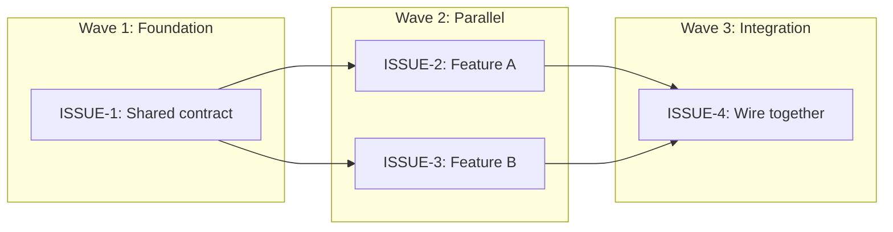

# To Issues

Convert a validated implementation plan into **local issue drafts + execution manifest** for human approval and downstream execution by Herdr.

The workflow is:

```text
to-plan → validated technical implementation plan
→ to-issues → local issue drafts + execution manifest
→ human approval → to-issues publishes approved issues → Herdr launches workers
```

to-issues owns issue decomposition, issue-writing quality, and approved‑issue publication. It does not assign, branch, or execute.

## Four mandatory outputs

Every invocation produces exactly four outputs:

1. **Markdown issue drafts** — one per issue, written to `local://` URIs or the plan server.
2. **YAML execution manifest** — `version: 1` schema, complete dependency graph, ownership data.
3. **Mermaid dependency and parallelism graph** — showing waves, foundation work, parallel branches, and integration.
4. **Decomposition analysis** — explaining boundary choices, parallelism, ownership collisions, and scope confidence.

The YAML manifest is the machine-readable source of truth. The Markdown is the human explanation. Before finishing, verify both representations agree.

## Hard contracts

### Issue-to-PR contract

- Every **implementation issue** MUST produce exactly one focused PR.
- One PR MUST NOT resolve multiple issues.
- A PR for a non-terminal issue MUST NOT close the source branch.

### Boundary contract

Prefer a narrow, complete vertical slice through every required layer.

Create a separate shared/foundation issue only when later issues cannot safely start or be verified without a shared prerequisite (a contract, migration, fixture, public interface, compatibility layer, or required setup). Foundation issues MUST stay limited to the prerequisite. They MUST NOT absorb feature behavior.

### Context contract

Every implementation issue must explain:

1. What changes and why.
2. The boundary owned by this PR.
3. What observable behavior or system state proves completion.
4. How to verify.
5. Explicit dependencies and ownership.

Do not require the assignee to know this skill, the original chat, or plan-server conventions.

### Authority contract

The validated implementation plan is the authority for **intended behavior**.

The inspected codebase is the authority for **current behavior**, **existing structure**, and **implementable paths**.

Never invent paths, commands, interfaces, or dependencies.

### Publish-after-approval contract

This skill produces local output until the human approves the issue set. After approval:

- Publish approved GitHub issues.
- Record returned issue numbers and URLs for the execution manifest.

This skill must not:

- Publish GitHub issues before human approval.
- Assign GitHub users automatically.
- Create branches or worktrees.
- Launch Herdr or OMP agents.
- Create pull requests.
- Implement code.

Publication, branching, worktree creation, and agent launch all happen after human approval, ordered by this sequence.

### Dependency contract

- Every dependency MUST explain why it exists.
- Differentiate: **hard dependency** (cannot start safely), **integration dependency** (can start but cannot verify), **no dependency** (fully parallel).
- The dependency graph MUST be acyclic.

## Gather the source

Prefer the most concrete source available:

1. `to-plan` artifact or plan-server URL.
2. A validated specification or FRD.
3. A conversation or brief with confirmed decisions.

For a plan artifact: read the full file. For a plan-server plan: read the root MDX and every concern file referenced in it.

## Inspect the relevant codebase

Codebase inspection is mandatory before decomposition. Inspect the smallest relevant area deeply enough to verify:

- Current behavior and data flow.
- Existing types, interfaces, schemas, and entry points.
- File and module boundaries.
- Tightly coupled modules.
- Existing tests and test infrastructure.
- Known ownership patterns.

Read callers and consumers before treating a symbol as a stable boundary.

Classify findings as:

- **Required** — locked by the approved source.
- **Implied** — necessary for correctness or verification but not stated.
- **Discretionary** — assignable design decisions.
- **Conflicting** — the plan asserts something the codebase contradicts; flag for human resolution.

## Build a concise feature brief

Extract only:

- Current state (one to two sentences).
- Target behavior (two to three sentences).
- Key design constraints.
- Which plan sections map to which subsystems.

Do not copy the entire source.

## Decompose into issues

### One issue = one focused PR

Each issue must represent one coherent, independently understandable outcome.

Apply this test:

> Could a reviewer understand, verify, approve, or reject this PR without needing unrelated changes from another PR?

Do not optimize for the largest number of issues or active agents.

### Prefer behavior-complete boundaries

Avoid splitting exclusively by implementation layer when each resulting PR would be incomplete.

**Bad:**

```text
Issue 1: Add table
Issue 2: Add repository method
Issue 3: Add service method
Issue 4: Add endpoint
```

**Better when reasonably scoped:**

```text
Issue 1: Persist device registration end-to-end
  - approved schema change
  - repository behavior
  - service behavior
  - endpoint behavior
  - focused tests
```

Do not force a vertical slice when it creates an oversized PR, unsafe ownership overlap, or an unreviewable change. Use reviewer clarity and separation of responsibility as the deciding criteria.

### Apply the automatic split test

Split proposed work when any of these are true:

- It contains multiple independently valuable outcomes.
- Its acceptance criteria describe unrelated behaviors.
- Parts have different dependency chains.
- Parts can be safely implemented and reviewed in parallel.
- It combines a shared foundation with feature behavior.
- Safe review would require multiple PRs.

Do not split by file count or technical layer alone.

For wide mechanical refactors, use expand-contract:

1. Expand: add the new form beside the old.
2. Migrate: update callers in reviewable batches.
3. Contract: remove the old form after no callers remain.

Each batch is one implementation issue with explicit blockers.

### Protect file and module ownership

For every issue, identify:

- Likely files.
- Likely directories.
- Tightly coupled modules.
- Shared contracts.
- Possible ownership collisions.

Two issues that likely modify the same file or tightly coupled module MUST NOT be marked as concurrently executable unless the overlap is explicitly justified.

Resolve overlap by:

- Changing issue boundaries.
- Creating a dependency.
- Identifying an upstream contract issue.
- Marking the conflict for human review.

### Make dependencies explicit

Record for every issue:

- `Depends on` — issue keys it blocks on.
- `Blocks` — issue keys it gates.
- `Blocks` — issue keys it gates.
- Dependency reason — why the dependency exists.
- Dependency type — `hard`, `integration`, or `none`.

### Build the issue graph

A blocking edge exists only when an issue cannot safely start or cannot be verified until another issue closes. Do not use blockers for preferred order, convenience, or parent-child grouping.

The dependency graph MUST be acyclic.

## Write issue drafts

Use the required template below. Every issue must contain enough context for a coworker to understand what the agent is doing without copying the entire implementation plan.

### Issue draft template

```markdown
# <Focused outcome title>

## Why
<Problem, user/developer impact, and why this work is needed>

## Target behavior
<Observable behavior that must exist after completion>

## Scope
- <Responsibility owned by this issue>

## Out of scope
- <Responsibility explicitly owned elsewhere or intentionally excluded>

## Acceptance criteria
- [ ] <Binary, observable criterion>

## Verification
- `<exact or repository-appropriate command>`
- <manual verification only when automation is unsuitable>

## Dependencies
- Depends on: <issue key or none>
- Blocks: <issue key or none>
- Dependency reason: <why>

## Plan reference
- <Relevant plan path and sections>

## Likely ownership
- Files/modules: <likely paths>
- Shared contracts: <contracts>
- Collision risk: <risk or none>

## Parallel execution notes
<What can safely happen concurrently and what cannot>
```

Omit optional subsections instead of filling them with low-value prose. Keep dependency fields explicit even when the value is `None`.

### Acceptance criteria

Acceptance criteria MUST describe observable outcomes and required invariants. Do not use coding activities as the primary criteria:

- Create a component
- Add an endpoint
- Update the schema
- Write tests

Place those under Scope when useful. Every criterion must be binary enough for a reviewer to mark pass or fail.

### Verification

Use the strongest verified proof available:

1. Exact repository commands.
2. Integration or manual scenarios with expected results.
3. Relevant existing CI checks.

Include exact commands only when verified. Never invent scripts or test names. State the expected result, not merely `run tests`.

## YAML execution manifest

Produce one fenced YAML block using this minimum schema:

```yaml
version: 1
source_plan:
  path: <plan path>
  revision: <hash, timestamp, or identifier>
issues:
  - key: <stable-local-key>
    title: <focused title>
    why: <concise reason>
    target_behavior:
      - <observable behavior>
    scope:
      - <owned responsibility>
    out_of_scope:
      - <explicit exclusion>
    acceptance_criteria:
      - <binary criterion>
    verification:
      - <command or verification method>
    dependencies:
      - <issue key>
    dependency_reason: <reason or none>
    blocks:
      - <issue key>
    parallel_group: <wave/group identifier>
    likely_paths:
      - <path>
    owned_modules:
      - <module or subsystem>
    shared_contracts:
      - <contract or none>
    collision_risks:
      - <issue key and explanation>
    human_owner: pending
    execution_mode: pending
```

Rules:

- `key` values MUST be unique and stable (e.g. `ISSUE-1`, `ISSUE-2`).
- Every dependency MUST reference an existing key.
- `dependencies` and `blocks` MUST be mutually consistent.
- The dependency graph MUST contain no cycles.
- `human_owner` and `execution_mode` remain `pending` until human approval.
- Do not place local worktree paths, branches, pane IDs, or runtime state in this manifest.
- Do not include implementation detail that belongs only in the plan unless needed to define scope.

## Dependency and parallelism graph

Produce a Mermaid graph showing:

- Dependency direction (top-to-bottom or left-to-right).
- Execution waves (group nodes reachable in the same wave).
- Foundation/shared-contract work.
- Safely parallel branches (same wave, no cross-edges).
- Final integration work.

Use subgraph blocks to show waves. The graph MUST match the YAML manifest exactly — every issue key, every dependency edge, every wave boundary.



## Decomposition analysis

Before the drafts, produce a concise analysis covering:

- **Boundary rationale** — why each issue boundary was chosen.
- **Parallel execution** — which issues can run concurrently and why.
- **Sequencing** — which issues must wait and what they depend on.
- **Ownership collisions** — likely path/module collisions, whether resolved or flagged.
- **Scope confidence** — whether any issue is close to exceeding one-PR scope.
- **Ambiguity** — any ambiguity requiring human judgment.

Do not expose hidden reasoning. Provide concise conclusions and evidence.

## Self-validation

Before returning output, verify every item below. If validation fails, correct the output before returning. If the plan itself is insufficient (not implementation-ready, missing architecture), return it to `to-plan` with exact deficiencies rather than inventing missing architecture.

### Validation checklist

- [ ] The source plan is implementation-ready (concrete enough for an agent to execute).
- [ ] Every issue maps to plan content.
- [ ] Every issue fits one focused PR.
- [ ] Acceptance criteria are observable and binary.
- [ ] Verification is concrete (exact commands or named scenarios).
- [ ] Issue keys are unique.
- [ ] All dependency references exist (no dangling keys).
- [ ] The dependency graph is acyclic.
- [ ] `dependencies` and `blocks` are mutually consistent.
- [ ] Markdown and YAML agree on issue count, keys, dependencies, and waves.
- [ ] Parallel groups respect dependencies (no issue in a group depends on another in the same group).
- [ ] Ownership collisions are surfaced in both Markdown and YAML.
- [ ] No GitHub issue publication or execution occurred.

## Verification scenarios

Test or simulate at least these three scenarios before finishing.

### Scenario 1: Parallel feature

A plan with one shared contract, two independent downstream implementations, and one final integration issue.

Expected result:
- Correct dependency graph.
- Two issues in the same parallel wave.
- No overlapping file ownership.
- Final issue blocked until both dependencies complete.

### Scenario 2: Overlapping files

A plan where two proposed issues modify the same central file.

Expected result:
- Issues are restructured, sequenced, or collision risk is explicitly surfaced.
- They are NOT marked safe for concurrent execution without justification.

### Scenario 3: Small sequential change

Expected result:
- One focused issue.
- No artificial splitting.
- Valid one-node graph (single issue, no dependencies).
- Clear verification.

## Context budget

To prevent bloated issues:

- Summarize the larger feature; do not repeat the full specification.
- Include only codebase findings relevant to this PR.
- Do not list every file discovered.
- Do not repeat dependency information in narrative sections.
- Do not restate acceptance criteria as verification steps.
- Avoid large code snippets. Include only decision-rich contracts, schemas, state machines, or type shapes that prose cannot express precisely.
- Remove any sentence that does not affect scope, correctness, coordination, or proof.

## Draft review and output format

Before finalizing, present:

1. A two-to-four sentence feature summary.
2. Issue count and structure.
3. The Mermaid dependency and parallelism graph.
4. The YAML execution manifest.
5. The decomposition analysis.
6. Any ambiguity requiring human judgment.

Then write the complete output:

1. Markdown drafts to `local://` URIs (one per issue) or inline fenced blocks.
2. YAML manifest as a fenced block.
3. Mermaid graph as a fenced block.
4. Decomposition analysis as prose.

Ask for approval of the complete issue set. Accept requested merges, splits, renamed boundaries, or dependency changes. Do not advance to Herdr execution until approved.

## Done when

- Humans can read each issue and understand exactly what work is being claimed.
- Herdr can consume the YAML manifest without inferring dependencies or ownership.
- Issue boundaries create small, focused, reviewable PRs.
- Parallelism is safe rather than merely aggressive.
- Markdown and YAML are guaranteed to match.
- No GitHub issue is published before human approval.
