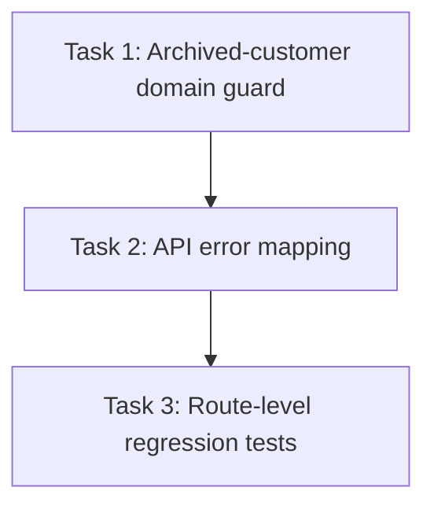

# Plan Calibration Example

Read this file before writing every plan.

Use it to calibrate:

* repository specificity;
* implementation-level explanations;
* task size;
* sequencing;
* verification;
* binary completion criteria.

Do not copy the fictional project, paths, symbols, commands, or decisions below. Replace them with evidence from the active repository.

## Weak Plan

```md
## Work Breakdown

1. Update the backend.
2. Add validation.
3. Add tests.
```

This is not implementation-ready because it does not identify:

* the existing behavior;
* the target behavior;
* affected files or symbols;
* dependencies;
* verification commands;
* what proves each task is complete.

## Strong Single-File Plan

````mdx
---
title: "Implementation Plan: Reject Archived Customers During Invoice Creation"
status: ready
created: 2026-07-13
project: "example-billing"
tags: [plan, implementation, api, billing]
repo: "github.com/example/example-billing"
author: "Example Author"
branch: "main"
commit: "8ab17cf"
summary: "Prevent invoice creation for archived customers while preserving the existing active-customer flow."
last_updated: 2026-07-13T18:42:00-07:00
last_updated_by: "Example Author"
type: plan
parent: "/home/example/Documents/Github/plan-server/projects/example-billing/research/2026-07-13_archived-customer-behavior.mdx"
phase_count: 3
---

# Implementation Plan: Reject Archived Customers During Invoice Creation

## Goal

Prevent API clients from creating invoices for archived customers.

The change must fail before invoice persistence, return the repository’s existing customer-state error format, and leave active-customer invoice creation unchanged.

## Current State

`packages/api/src/routes/invoices.ts` handles `POST /invoices` through `createInvoiceHandler`.

The handler currently:

1. validates the request body with `createInvoiceSchema`;
2. passes `customerId` and line items to `InvoiceService.createInvoice`;
3. converts service errors through `toApiError`.

`packages/core/src/invoices/invoice-service.ts` loads the customer through `CustomerRepository.findById`, but only checks whether the customer exists. It does not inspect `customer.status`.

`packages/core/src/customers/customer.ts` defines:

```ts
type CustomerStatus = "active" | "archived";
````

Existing route coverage in `packages/api/src/routes/invoices.test.ts` verifies:

* successful invoice creation;
* unknown customer rejection;
* invalid line-item rejection.

There is no archived-customer regression case.

## Target State

When `POST /invoices` references an archived customer:

* no invoice record is created;
* `InvoiceService.createInvoice` returns `CustomerArchivedError`;
* the API returns HTTP `409`;
* the response uses the existing error envelope;
* active-customer behavior remains unchanged.

Completion is proven by service-level and route-level regression tests plus the repository’s standard typecheck and test commands.

## Scope

### In Scope

* archived-customer validation in `InvoiceService.createInvoice`;
* a typed domain error for the rejected state;
* mapping that error to the existing API error envelope;
* service and route regression coverage;
* unchanged behavior for active and unknown customers.

### Out of Scope

* restoring archived customers;
* changing customer archival behavior;
* changing invoice database schemas;
* altering existing invoice response payloads;
* adding new dependencies.

## Locked Decisions

* Customer state remains represented by the existing `CustomerStatus` union.
* Archived-customer rejection belongs in the service layer because invoice creation can be called outside the HTTP route.
* The API uses HTTP `409`, matching other state-conflict errors in `packages/api/src/errors/to-api-error.ts`.
* No database migration is required.

## Implementation Strategy

Add the archived-state guard immediately after the customer lookup in `InvoiceService.createInvoice`.

Represent the failure as a typed domain error, then extend the existing API error mapper. This keeps business validation inside the service while preserving the route’s current orchestration pattern.

Add service coverage first to lock the domain behavior, followed by route coverage to verify HTTP translation and persistence behavior.

## Work Breakdown

### Task 1: Add the archived-customer domain guard

* **Outcome:** `InvoiceService.createInvoice` rejects archived customers before constructing or persisting an invoice.
* **Relevant areas:** `packages/core/src/invoices/invoice-service.ts`, `packages/core/src/invoices/errors.ts`, `InvoiceService.createInvoice`, `CustomerRepository.findById`.
* **Changes:** Add `CustomerArchivedError`; inspect `customer.status` after the existing not-found check; return the typed error when status is `archived`; preserve active-customer execution.
* **Depends on:** None.
* **Verification:** Add service tests for archived and active customers, then run `pnpm test packages/core/src/invoices/invoice-service.test.ts`.
* **Done when:** The archived case returns `CustomerArchivedError`, performs no invoice insert, and all existing active and unknown-customer tests pass.

### Task 2: Map the domain error to the API response

* **Outcome:** The invoice route returns the repository-standard `409` response for archived customers.
* **Relevant areas:** `packages/api/src/errors/to-api-error.ts`, `packages/api/src/routes/invoices.ts`, `toApiError`.
* **Changes:** Add `CustomerArchivedError` handling to `toApiError`; use the existing error envelope and stable error code; do not add route-specific branching.
* **Depends on:** Task 1.
* **Verification:** Run the error-mapper unit tests and confirm the mapped status, code, and message.
* **Done when:** `CustomerArchivedError` consistently maps to HTTP `409` without changing existing error mappings.

### Task 3: Add route-level regression coverage

* **Outcome:** Integration coverage proves the API rejection and confirms no invoice is persisted.
* **Relevant areas:** `packages/api/src/routes/invoices.test.ts`, existing customer and invoice fixtures.
* **Changes:** Add an archived customer fixture; call `POST /invoices`; assert HTTP `409` and the existing error envelope; query the invoice fixture store to confirm no insert occurred; retain an active-customer success assertion.
* **Depends on:** Tasks 1 and 2.
* **Verification:** Run `pnpm test packages/api/src/routes/invoices.test.ts`, then `pnpm typecheck`.
* **Done when:** The archived regression passes, no persistence occurs, and all existing invoice route tests remain green.

## Dependency and Parallel Execution



This is a fully sequential change. Each task depends on the preceding task's output.

| Work area | Responsibility | Likely paths/modules | Depends on | Can run with | Verification gate |
|---|---|---|---|---|---|
| Domain guard | Reject archived customers in `InvoiceService.createInvoice` | `packages/core/src/invoices/invoice-service.ts`, `packages/core/src/invoices/errors.ts` | None (defines the error contract) | — | `InvoiceService.createInvoice` returns domain error for archived customer |
| API error mapping | Translate domain error to HTTP 409 | `packages/api/src/routes/invoices.ts`, existing error mapper | Domain guard error contract | — | Route returns 409 for archived customer |
| Route regression tests | Verify end-to-end rejection and no persistence | `packages/api/src/routes/invoices.test.ts`, per-test fixture factory | API error mapping | — | Archived regression passes, no invoice persisted |

### Sequential

All work is sequential. Task 1 defines the domain error and service behavior. Task 2 depends on that error type for API translation. Task 3 verifies the complete route-to-service behavior.

### Parallel

No implementation tasks should run in parallel because each defines contracts consumed by the next.

Test-fixture preparation for Task 3 may begin during Task 2 only if it avoids editing the same service or error-mapping files.

### Shared Contracts

| Contract | Defined in | Consumed by | Must be ready before | Compatibility verification |
|---|---|---|---|---|
| `CustomerArchivedError` type and error propagation | Task 1: `packages/core/src/invoices/errors.ts` | Task 2: API error mapper | Task 2 starts | Typecheck + service test |
| API 409 response envelope | Task 2: error mapper | Task 3: route tests | Task 3 starts | API integration test |

## Testing and Verification

* **Completion oracle:** `pnpm test --filter invoices && pnpm typecheck` — exit `0` means the effort is complete; any non-zero exit means it is not, regardless of task-level reports.
* Service regression: `pnpm test packages/core/src/invoices/invoice-service.test.ts`
* API regression: `pnpm test packages/api/src/routes/invoices.test.ts`
* Type verification: `pnpm typecheck`
* Persistence evidence: archived-customer route test confirms the invoice repository received no insert.
* Regression evidence: active-customer and unknown-customer tests remain unchanged and pass.

## Risks and Edge Cases

* **Guard placed only in the route:** Non-HTTP callers could still create invalid invoices. Mitigation: enforce the rule in `InvoiceService`.
* **Error checked after persistence begins:** A partial invoice could be written. Mitigation: validate customer status before invoice construction or repository insertion.
* **Archived fixture reused across tests:** Shared state could make tests order-dependent. Mitigation: create the archived customer through the existing per-test fixture factory.
* **Error mapper fallback catches the new error:** The API could return `500`. Mitigation: add a direct mapper test for `CustomerArchivedError`.

## Definition of Done

* [ ] Archived customers cannot create invoices through `InvoiceService`.
* [ ] The API returns HTTP `409` using the existing error envelope.
* [ ] No invoice is persisted for an archived customer.
* [ ] Active-customer invoice creation remains unchanged.
* [ ] Unknown-customer behavior remains unchanged.
* [ ] Service and route regression tests pass.
* [ ] Typecheck passes.
* [ ] No schema, dependency, or unrelated API changes are introduced.

````

## Bundle Calibration

Use a bundle only when execution should be divided across independent agents, branches, or PRs.

```text
2026-07-13_invoice-state-enforcement/
├── index.mdx
├── 0-domain-contract.mdx
├── 1-api-integration.mdx
└── 2-client-handling.mdx
````

The relationships should be:

```text
Source artifact
      ↓
   index.mdx
      ↓
0-domain-contract.mdx
      ↓
1-api-integration.mdx
      ↓
2-client-handling.mdx
```

`index.mdx` contains:

* the overall goal;
* target state;
* complete scope;
* locked decisions;
* concern ownership;
* dependency order;
* cross-concern verification;
* branch or PR boundaries.

Each concern file contains only:

* its outcome;
* relevant repository evidence;
* concrete tasks;
* dependencies on earlier concern files;
* local verification;
* risks specific to that concern;
* binary completion criteria.

Do not repeat the full index inside every concern file.

## Fan-out Calibration

The example above is a small sequential plan, so it correctly omits `## Shared Convention Artifacts` and `## Fleet Rules`. Those sections belong to plans executed by several concurrent agents. This fragment calibrates them.

Scenario: replace a deprecated `logger.log(msg, meta)` call with structured `logger.info({ event, ...fields })` across ~180 call sites in 9 packages.

### Shared Convention Artifacts

| Artifact | Fixes | Populated by | Consumed by | Amendment owner |
|---|---|---|---|---|
| `docs/logging-migration.md` | The mapping from each legacy call shape to its structured replacement, including how free-text messages become `event` names | Authored in wave 0, reviewed before fan-out | Every migration work area | Commander; amendments pause fan-out |
| `docs/log-events.tsv` | One row per call site: file, current message, assigned `event` name, field names | Generated from `rg` output, then reviewed for naming collisions | Every migration work area | Commander |

Without `log-events.tsv`, nine agents invent nine naming schemes for the same events and the divergence is invisible until the dashboards break. The artifact closes that decision once, before any agent starts.

### Fan-out (mechanical)

- **Work queue:** `rg -n --glob '!**/*.test.ts' 'logger\.log\(' packages/ | sort`
- **Item identity:** `file:line`
- **Grouping:** by package — one owner per package, no cross-package edits
- **Order:** arrival order from the command's output
- **Remaining count is the progress metric:** the queue is empty when `rg` returns nothing.

### Parallel

The 9 packages hold no shared files, so all 9 migration work areas run concurrently after wave 0. `packages/logger` itself is sequential and must merge first — it owns the `logger.info` signature the other eight consume.

## Fleet Rules

- **Forbidden:** `git stash`, `git reset`, `git checkout .`, `git clean`, `git add -A`, `git add .`, force-push
- **Commits:** stage explicitly named paths only — `git add <path> [<path>…]`
- **Search:** scope every search to `packages/<owned-package>/`; no unguarded repository-wide `grep`/`find`
- **Build and test:** `pnpm test --filter <owned-package>`; `pnpm typecheck` at the verification gate only — it walks the whole workspace and blocks every concurrent worker's disk while it runs
