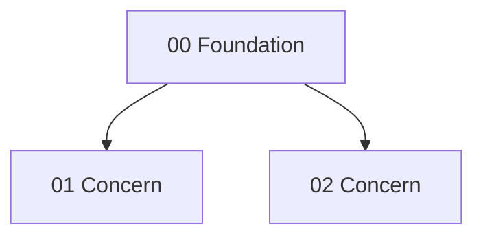

# To-Plan Folder Bundles

Use this file when an implementation plan is too large to stay as one readable, execution-ready artifact.

The goal is not to create more documentation. The goal is to keep each implementation slice small enough for one agent, one branch, or one PR-sized concern without losing the dependency chain.

## Output Modes

`to-plan` has two output modes:

1. **Single-file plan** — default for small or medium plans.
2. **Folder bundle** — for large plans that need concern-level execution files.

Use `.mdx` for plan-server compatibility even when the user says "markdown". Keep the content plain Markdown-compatible unless MDX features are already useful.

## Reader Balance

Plan bundles serve two readers at once:

- **Human owner:** needs plain-language rationale, architecture decisions, tradeoffs, dependency order, and enough context to explain the work confidently.
- **Implementation agent:** needs narrow scope, exact files/symbols, dependencies, verification, and risks without repeated background.

Balance rules:

1. Put the human-readable why in `index.mdx`: goal, rationale, decisions, tradeoffs, dependency graph, and PR order.
2. Put implementation detail in concern files: scoped changes, relevant files, verification, risks, and Done criteria.
3. Do not teach generic concepts the agent already knows.
4. Do not paste the same background into every concern file; link back to `index.mdx`.
5. Use simple language. Prefer short bullets and tables over long prose.
6. Keep rationale concrete: decision, evidence, tradeoff, consequence.
7. If the human needs deeper challenge/review, leave a short `Grill prompts` section in `index.mdx` instead of expanding every concern file.

## Bundle Triggers

Create a folder bundle when at least one is true:

- the plan has 6+ implementation tasks;
- the plan naturally splits into 3+ independently reviewable concerns;
- the plan would exceed ~400 lines as one file;
- one task file would exceed ~250-300 lines after splitting;
- implementation should be done by multiple agents, branches, or PRs;
- the work crosses 3+ domains such as data, API, UI, jobs, auth, infra, tests, docs;
- the plan contains foundation work that other concerns depend on;
- shared files or public interfaces require explicit sequencing to avoid merge conflicts.

Do not create a folder bundle for a small, local change. A bundle with only one concern is a smell; write a single-file plan instead.

## Bundle Location

Create bundles under the same plan-server project and `plans/` directory:

```text
~/Documents/plan-server/projects/{project}/plans/{id}/
```

Required files:

```text
{id}/
├── index.mdx
├── 00-foundation.mdx
├── 01-{concern}.mdx
├── 02-{concern}.mdx
└── NN-{concern}.mdx
```

Use `00-foundation.mdx` for the first dependency-setting slice when the plan has shared setup, contracts, schema, interfaces, fixtures, or scaffolding that later concerns need. If there is no foundation slice, still start numbering at `00-{first-concern}.mdx`.

## Creating the Bundle Path

Use the existing artifact helper to reserve a stable plan id and project:

```bash
rtk python3 ~/.agents/scripts/new-artifact.py \
  --dest "$HOME/Documents/plan-server" \
  --type plans \
  "<concise-plan-topic>"
```

For a single-file plan, overwrite the printed `.mdx` file as usual.

For a folder bundle:

1. Use the exact printed path as the id source.
2. Strip the `.mdx` extension to get the bundle directory.
3. Move or replace the helper-created file with `{bundle-dir}/index.mdx`.
4. Write concern files beside `index.mdx`.
5. Copy the bundle directory path to the clipboard, not a single child file path.

Example:

```text
Created: /Users/me/Documents/plan-server/projects/app/plans/2026-07-08_12-00-00_billing-retry.mdx
```

Bundle paths:

```text
/Users/me/Documents/plan-server/projects/app/plans/2026-07-08_12-00-00_billing-retry/index.mdx
/Users/me/Documents/plan-server/projects/app/plans/2026-07-08_12-00-00_billing-retry/00-foundation.mdx
/Users/me/Documents/plan-server/projects/app/plans/2026-07-08_12-00-00_billing-retry/01-webhook-idempotency.mdx
```

## Index Requirements

`index.mdx` is the navigation and execution map. It must be short enough to skim.

Required sections:

```mdx
---
title: "Implementation Plan Bundle: {Concise Name}"
status: ready
created: {date}
project: "{project}"
tags: [plan, implementation, bundle, {domain-tags}]
repo: "{repo}"
author: "{author}"
branch: "{branch}"
commit: "{commit}"
summary: "{one-sentence outcome}"
last_updated: {date-or-iso}
last_updated_by: "{author}"
type: plan-bundle
parent: "{source artifact path if any}"
phase_count: {N}
---

# Implementation Plan Bundle: {Concise Name}

## Goal

{Outcome and why it matters.}

## Why This Is Split

- {Plain-language reason this bundle is better than one large plan: task count, concern count, PR boundaries, agents, line size, or risk.}

## Rationale

- {Decision}: {why this approach, evidence, tradeoff, and consequence in plain language.}

## Navigation

| Order | Concern | File | Branch / PR scope | Depends on | Can run in parallel with |
|---:|---|---|---|---|---|
| 00 | Foundation | `00-foundation.mdx` | `{branch-name}` | None | None |
| 01 | {Concern} | `01-{concern}.mdx` | `{branch-name}` | 00 | 02 if no shared files |

## Dependency Graph



## Shared Decisions

- {Decision all concern files must obey, with evidence.}

## Shared Risks

- {Cross-cutting risk that concern files reference instead of duplicating.}

## Grill Prompts

- {Question a human should be able to answer or take to the grill-me workflow before implementation.}

## Execution Rules

- Work each concern as a separate branch or PR unless two adjacent concerns are tightly coupled and small.
- Do not edit files owned by another active concern unless the index lists the shared-file conflict.
- Merge dependency-setting concerns before dependent concerns.
- If a concern grows beyond one PR-sized review, split that concern before implementation.

## Definition of Done

- [ ] Every concern file's Done criteria are satisfied.
- [ ] Dependency order was respected.
- [ ] Shared-file conflicts were resolved in the order listed.
- [ ] Final end-to-end verification from the last concern passes.
```

## Concern File Requirements

Each concern file is a narrow implementation plan for one PR-sized branch. It must be executable without rereading the whole bundle, but it must not duplicate the full index.

Required sections:

```mdx
---
title: "{NN}: {Concern Name}"
status: ready
created: {date}
project: "{project}"
tags: [plan, implementation, concern, {domain-tags}]
repo: "{repo}"
author: "{author}"
branch: "{branch}"
commit: "{commit}"
summary: "{one-sentence concern outcome}"
last_updated: {date-or-iso}
last_updated_by: "{author}"
type: plan-concern
parent: "index.mdx"
order: {NN}
depends_on: [{dependency numbers or file names}]
---

# {NN}: {Concern Name}

## Purpose

{One concrete outcome.}

Keep this file compact. It should contain only the context needed to implement this concern safely. Link to `index.mdx` for shared rationale instead of repeating it.

## Branch / PR Scope

- Suggested branch: `{branch-name}`
- PR should include: {files/behaviors in this concern}
- PR should not include: {neighboring concerns or deferred work}

## Dependencies

- Depends on: `{dependency-file}` because {specific reason}.
- Blocks: `{dependent-file}` because {specific reason}.

## Relevant Areas

- `path/to/file.ext`
- `SymbolOrRouteName`

## Changes

- {Concrete change.}
- {Concrete change.}

## Verification

- `{exact command}`
- Expected result: {observable behavior or output}.

## Risks and Edge Cases

- {Specific failure mode} — mitigation: {implementation/test requirement}.

## Done When

- [ ] {Binary completion condition.}
- [ ] {Binary completion condition.}
```

## Splitting Rules

1. Split by concern, not by file type alone. A concern is one reviewable behavior or contract change.
2. Prefer one concern per branch/PR. Allow two only when they are tightly coupled and still small.
3. `00-foundation` owns shared contracts: schemas, migrations, public interfaces, shared fixtures, feature flags, setup, or scaffolding.
4. Later concern files build on earlier files. Dependencies must point backward only.
5. Keep each concern file under ~250-300 lines when possible; split again before it becomes a context sink.
6. Keep shared context in `index.mdx`; concern files link back instead of copying the whole background.
7. Every concern file needs its own verification and Done criteria.
8. Every shared-file conflict must appear in the index navigation table or execution rules.
9. Do not create placeholder concern files. Each file must contain real implementation work.
10. If the plan cannot be split without inventing work, use a single-file plan.

## Final Response for Bundles

After writing a bundle, respond with:

```text
Implementation plan bundle written:
- Folder: `{absolute bundle directory}`
- Index: `{absolute bundle directory}/index.mdx`
- URL: `{best available plan-server URL or "not listed by current plan server without folder support"}`

Bundle shape:
- Concerns: {N}
- Foundation: {yes/no}
- Sequential: {short dependency chain}
- Parallelizable: {count or short list}
- Blocked: {count or "none"}
- Open questions: {count or "none"}

Next step: start with `{absolute bundle directory}/00-foundation.mdx`, then follow `index.mdx` dependency order.
```
