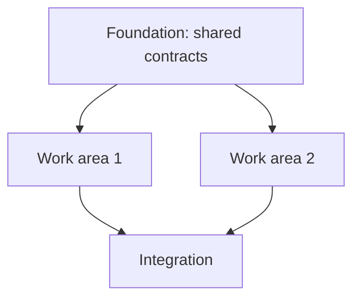

# To Plan

Create an implementation-ready plan that another coding agent or small team can execute without reconstructing the original conversation.

The plan is an execution artifact, not a stakeholder report. Include context only when it helps an agent implement, sequence, or verify the work.

## Inputs

`$ARGUMENTS` may contain:

* a research, explore, design, FRD, handoff, review, issue, PR, or existing plan artifact;
* a pasted brief or rough request;
* a continuation of the current conversation.

Treat upstream artifacts as evidence, not unquestionable specifications. Verify repository claims whenever repository access is available.

## Required References

Before writing every plan:

1. Read `EXAMPLE.md` from this skill directory.
2. Use it to calibrate specificity, structure, sequencing, and verification.
3. Do not copy its fictional paths or implementation details.

Read additional files only when triggered:

* `SUBAGENT_LENSES.md` — only when specialist critique is warranted.
* `PLAN_BUNDLES.md` — only when creating a folder bundle.
* `SKILL_TESTS.md` — only when testing or modifying this skill; never during normal plan generation.

## Metadata

Run:

```bash
node "${SKILL_DIR}/../_shared/now.mjs"
echo
node "${SKILL_DIR}/../_shared/git-context.mjs"
```

Use the returned metadata verbatim.

* Do not rewrite timestamp offsets.
* Use repository, branch, commit, root, and author values from `git-context.mjs`.
* When no repository is available, record that limitation under `## Assumptions`.

## Workflow

### 1. Resolve the Request

Extract:

* the user’s intended outcome;
* current behavior;
* desired behavior;
* constraints and non-goals;
* prior locked decisions;
* known failures;
* unresolved implementation-changing questions;
* the evidence required to prove completion.

Do not turn vague wording directly into tasks. First convert it into concrete implementation facts.

When a source artifact is provided:

* read it fully;
* follow references that affect implementation;
* preserve its path as the plan’s `parent`;
* verify technical claims against the repository.

When no artifact is provided:

* synthesize the request from the current conversation;
* inspect the repository before deciding how the work should be implemented.

Continue with available evidence when a missing source does not control architecture, product behavior, destructive work, or acceptance criteria.

### 2. Inspect the Repository

Before planning repository work:

* locate relevant files, modules, symbols, callers, configurations, tests, and commands;
* read representative implementation and test files;
* inspect references before changing exported symbols or public contracts;
* verify referenced paths and components exist before referencing them in the plan;
* identify existing architecture, naming, error-handling, and testing conventions;
* flag stale or conflicting architecture that may affect the implementation;
* distinguish verified facts from assumptions — mark unverifiable claims explicitly.

Use concrete references:

* `path/to/file.ext`
* `path/to/file.ext:line`
* `ComponentName`
* `function_name`
* test names and runnable commands

Do not invent files, symbols, commands, or architecture.

### 3. Define the Target State

State clearly:

* what behavior must exist after implementation;
* what existing behavior must remain unchanged;
* which systems are affected;
* what is explicitly out of scope;
* what observable evidence proves the implementation is complete.

The target state must be specific enough that an implementation agent does not need the original conversation.

### 4. Build the Execution Plan

Break the work into coherent tasks that one agent, ticket, branch, or PR can own.

Every task uses this contract:

```md
### Task N: {Action-oriented name}

- **Outcome:** {What exists after completion}
- **Relevant areas:** {Files, symbols, tests, or commands}
- **Changes:** {Concrete implementation work}
- **Depends on:** {Earlier tasks or decisions, or `None`}
- **Verification:** {Exact command or observable proof}
- **Done when:** {Binary completion condition}
```

Avoid vague work such as:

* update the backend;
* improve the UI;
* refactor as needed;
* add tests.

Replace it with repository-specific changes, affected symbols, expected behavior, and exact verification.

### 5. Map Parallel and Sequential Execution

Identify implementation work areas based on technical dependencies, file overlap, and shared contracts. The output of this step feeds directly into `to-issues` for issue decomposition.

#### Dependency and Parallel Execution

Every plan must contain a `## Dependency and Parallel Execution` section. This section is mandatory for every plan, even when all work is sequential.

Include a Mermaid `graph TD` showing implementation ordering. Use square-bracket nodes with task names and arrows for dependencies:



Do not fabricate parallelism. A small one-file change may have a single sequential node.

#### Execution-Boundary Table

Include a table with the following columns:

| Work area | Responsibility | Likely paths/modules | Depends on | Can run with | Verification gate |
|---|---|---|---|---|---|

The table describes technical work areas, not final issue boundaries. `to-issues` remains responsible for determining issue boundaries.

#### Shared Contracts

When multiple work areas depend on the same interface, schema, type, protocol, or behavior, identify:

* the canonical contract;
* where it is defined;
* which work consumes it;
* when it must be completed;
* how compatibility will be verified.

Workers must not be forced to guess an interface independently.

#### Execution Classification

Classify each work area as:

* **Sequential** — requires an earlier task or contract.
* **Parallel** — can be completed independently without shared-file or interface conflicts.
* **Blocked** — requires an unresolved implementation-changing decision.
* **Optional** — useful but unnecessary for the target state.

Name:

* shared-file conflicts;
* schema or public-interface dependencies;
* integration and merge order;
* likely file or tightly coupled module overlap;
* risks caused by parallel execution;
* verification required before downstream work begins;
* fixture and test dependencies;
* branch or PR boundaries;
* work that is safe to run in separate worktrees or agents.

Omit empty classifications.

## Plan Content Contract

Every plan must contain:

* `## Goal`
* `## Current State`
* `## Target State`
* `## Scope`
* `### In Scope`
* `### Out of Scope`
* `## Locked Decisions`
* `## Implementation Strategy`
* `## Work Breakdown`
* `## Dependency and Parallel Execution`
* `## Testing and Verification`
* `## Definition of Done`

`## Dependency and Parallel Execution` must contain:

* a Mermaid `graph TD` showing implementation ordering (a single sequential node is fine);
* an execution-boundary table with work area, responsibility, likely paths/modules, dependencies, parallel compatibility, and verification gate columns;
* shared contracts identification when multiple work areas share interfaces, schemas, types, protocols, or behavior;
* execution classification under `### Sequential`, `### Parallel`, and conditionally `### Blocked` and `### Optional` with file conflicts, merge order, and overlap risks.


Add these only when they change implementation or execution:

* `## Assumptions`
* `## Planning Critique`
* `## Alternatives Considered`
* `## Security Implications`
* `## Risks and Edge Cases`
* `## Open Questions`
* `### Blocked work`
* `### Optional work`

Do not create empty sections, generic review prompts, decorative MDX, or repeated summaries.

### Open Questions

Ask or record a question only when its answer materially changes:

* product behavior;
* architecture;
* destructive or difficult-to-reverse work;
* production access;
* credentials or sensitive data handling;
* acceptance criteria.

For every unresolved question include:

* why it matters;
* what decision it controls;
* the safest default if unanswered.

Proceed autonomously for reversible implementation decisions supported by repository evidence.

Adding a dependency or changing an internal interface does not automatically block planning. Document the rationale, impact, and verification path.

## Conditional Specialist Critique

Draft the implementation plan before deciding whether specialist critique is needed.

Trigger specialist critique when at least one applies:

* the work will be split across independent agents, branches, or PRs;
* the work affects authentication, authorization, billing, persisted data, migrations, public APIs, queues, workers, webhooks, infrastructure, or production rollout;
* verification is non-trivial or currently weak;
* user-facing work needs dedicated UX or accessibility review;
* the user explicitly requests specialist critique.

When triggered:

1. Read `SUBAGENT_LENSES.md`.
2. Select only lenses whose triggers match the plan and repository evidence.
3. Run selected lenses together when possible.
4. Provide each lens the user goal, draft plan, repository evidence, and its lens instructions.
5. Require only one of these responses:

```text
ready to execute
```

```text
revise plan: {severity} — {smallest concrete plan change}
```

Specialists must report implementation-changing findings only.

Fold accepted findings directly into scope, strategy, tasks, sequencing, verification, risks, security, or completion criteria.

Do not accept findings that:

* contradict a locked user decision;
* add unrelated or speculative work;
* introduce a dependency without implementation need;
* require unavailable product judgment;
* expand scope without a correctness, security, reliability, or verification reason.

Include `## Planning Critique` only when lenses ran. Record only findings that changed the plan or were intentionally rejected.

## Output Mode

### Single-file Plan

Use one `.mdx` plan when one agent can implement and review the work coherently.

Task count or document length alone does not require a bundle.

### Folder Bundle

Create a bundle only when the work should be executed through multiple independent agents, branches, or PRs.

Read `PLAN_BUNDLES.md` before writing a bundle.

Use:

```text
{id}/
├── index.mdx
├── 0-foundation.mdx
├── 1-{concern}.mdx
├── 2-{concern}.mdx
└── N-{concern}.mdx
```

Bundle rules:

* `index.mdx` is the parent execution plan.
* Its `parent` points to the original source artifact when one exists.
* Every concern file’s `parent` points to `index.mdx`.
* `index.mdx` owns the overall goal, scope, locked decisions, dependency graph, and execution order.
* Concern files contain only the context needed for their execution slice.
* Each concern should fit one branch or PR.
* A concern may depend only on earlier-numbered files.
* Use `0-foundation.mdx` when shared contracts, schemas, fixtures, setup, migrations, or interfaces unblock later work.
* Otherwise begin with `0-{first-concern}.mdx`.
* Do not duplicate the complete index context into every concern file.

## Artifact Writing

### Create the Artifact Path

Run:

```bash
rtk python3 ~/.agents/scripts/new-artifact.py \
  --dest "$HOME/Documents/plan-server" \
  --type plans \
  "<concise-plan-topic>"
```

Use the exact path printed by the helper.

Do not reconstruct it manually.

* For a single plan, overwrite the generated `.mdx` file.
* For a bundle, remove `.mdx` from the generated path, create that directory, and write `index.mdx` plus numbered concern files inside it.
* Leave `--project` unset unless the user explicitly names a project.

### Frontmatter

Every plan-server `.mdx` artifact must use:

```yaml
---
title: "Implementation Plan: {Concise Name}"
status: ready
created: {full ISO timestamp from metadata}
project: "{project inferred from generated path}"
tags: [plan, implementation, {domain-tags}]
repo: "{repo from git-context.mjs}"
author: "{author from git-context.mjs}"
branch: "{branch from git-context.mjs}"
commit: "{commit from git-context.mjs}"
summary: "{one-sentence implementation outcome}"
last_updated: {full ISO timestamp from metadata}
last_updated_by: "{author from git-context.mjs}"
type: plan
parent: "{source artifact or parent plan path, when applicable}"
phase_count: {number of tasks represented by this file}
---
```

Omit `parent` only when no source or parent artifact exists.

### Review URL

For a single-file plan:

```text
http://localhost:3456/project/{project}/plan/{id}
```

For a bundle:

```text
http://localhost:3456/project/{project}/plan/{id}/index
```

Verify the URL:

```bash
if URL_ERROR="$(curl -fsS --max-time 3 -o /dev/null "$PLAN_URL" 2>&1)"; then
  printf 'Plan URL verified: %s\n' "$PLAN_URL"
else
  printf 'Plan URL unavailable: %s\n' "$URL_ERROR"
fi
```

Return the verified URL when it resolves.

When it does not resolve, return:

* the attempted URL;
* the exact verification failure;
* the artifact path;
* the bundle `index.mdx` path when applicable.

Do not make vague claims that nested plans “may not be supported.”

### Clipboard

Copy the durable execution path:

```bash
printf '%s' '<absolute-plan-or-bundle-path>' | pbcopy
```

* Single plan: copy the `.mdx` path.
* Bundle: copy the bundle directory path.

## Quality Gate

Before finishing, confirm:

* repository claims are verified or marked as assumptions;
* the target state is observable and testable;
* tasks name real implementation areas;
* each task has dependencies, verification, and a binary completion condition;
* sequencing reflects actual technical dependencies;
* parallel tasks do not hide shared-file or interface conflicts;
* the Mermaid dependency graph reflects real technical dependencies — do not fabricate parallelism;
* the execution-boundary table has all required columns with verified paths;
* shared contracts are identified when multiple work areas share interfaces, schemas, or behavior;
* execution waves, merge order, and file-conflict risks are named;
* open questions materially affect implementation;
* sequential dependencies strictly follow the execution graph;
* the artifact was written successfully;
* the review URL was tested;
* the correct path was copied to the clipboard.

## Final Response

Do not repeat the complete plan in chat.

For a single plan, return:

```text
Implementation plan written:
- File: `{absolute path}`
- URL: `{verified URL or attempted URL with exact failure}`
- Tasks: {N}
- Sequential work areas: {summary or none}
- Parallel work areas: {summary or none}
- Blocked: {summary or none}
- Shared contracts: {count or none}
- Execution waves: {N}
- Open questions: {count or none}

Copied to clipboard: `{absolute path}`
```

For a bundle, return:

```text
Implementation plan bundle written:
- URL: `{verified URL or attempted URL with exact failure}`
- Concerns: {N}
- Dependency order: {short chain}
- Parallel work areas: {summary or none}
- Blocked: {summary or none}
- Shared contracts: {count or none}
- Execution waves: {N}
- Open questions: {count or none}
Copied to clipboard: `{absolute bundle path}`
```

The durable output is the plan-server artifact, not the chat response.

